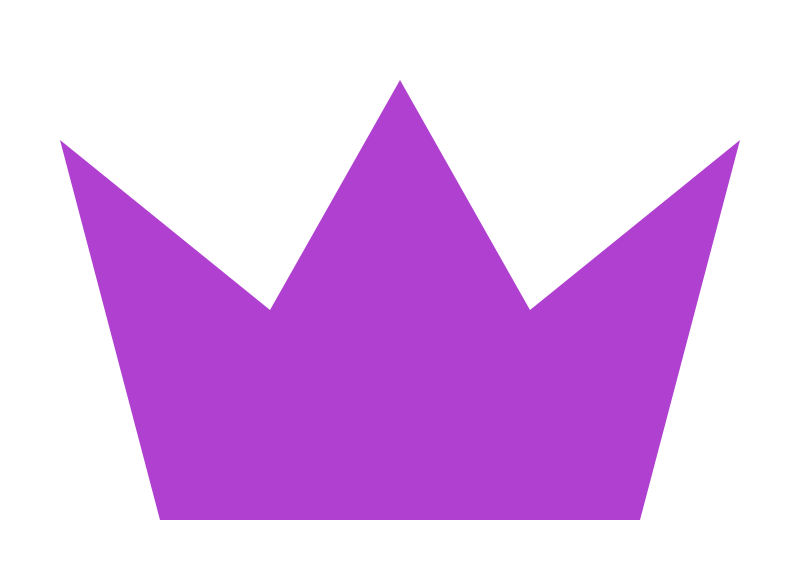

  

# 👑 Victor Emanuel — Vortex

**`Desenvolvedor Front-end Júnior • Criador da Liz AI`**

📍 Siqueira Campos — Paraná, Brasil 🇧🇷

<!-- Typing SVG -->

<!-- Social badges -->

---

## 👋 Sobre mim

Sou estudante e entusiasta de tecnologia, com foco em **desenvolvimento web**, **interfaces modernas** e **projetos com inteligência artificial**.

Atualmente estou estudando programação e construindo projetos próprios, principalmente envolvendo **front-end**, **design de interfaces**, **ruby** e **sistemas interativos**. Um dos meus principais projetos é a **Liz**, uma IA/interface com identidade visual própria, focada em tecnologia, criatividade e experiência de usuário.

Gosto de transformar ideias em projetos reais, testar layouts, melhorar interfaces e aprender como sistemas funcionam por trás. Também tenho interesse em **Linux**, **otimização de desempenho** e **desenvolvimento de jogos**.

 

  

---

## 👑 Experiência & Liderança

<table>
  <tr>
    <td width="50%" align="center" valign="top">
      
      <h3>Liz AI Studio</h3>
      <h4><em>CEO & Diretor de Construção Frontend</em></h4>
      
<strong>Liz AI Brasil</strong>

      
Lidero o desenvolvimento frontend da <strong>Liz</strong> — uma IA / interface com identidade visual própria, focada em tecnologia, criatividade e experiência de usuário.

    </td>
    <td width="50%" align="center" valign="top">
      
      <h3>🎮 Lux Games Studios</h3>
      <h4><em>CEO & Diretor de Programação</em></h4>
      
<strong>Desenvolvimento de Jogos</strong>

      
Crio e dirijo jogos e sistemas interativos, unindo programação, lógica de gameplay e design de experiência.

    </td>
  </tr>
</table>

---

## 🛠️ Stacks & Tecnologias

### 🎨 Linguagens & Front-end

 

### 🎮 Game Development

 

### 🗄️ Banco de Dados & Backend

 

### 🤖 IA & Ferramentas de Desenvolvimento

---

## 📊 GitHub Stats

 

---

  
   
  <em>Obrigado pela visita — bons códigos! 👋</em>

